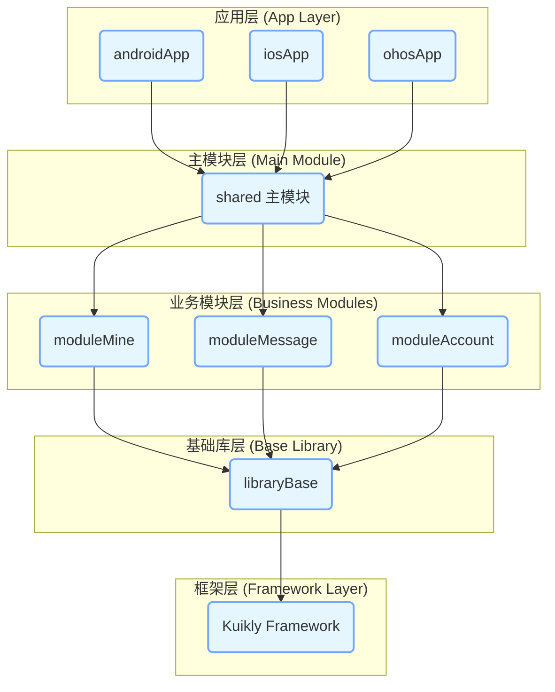
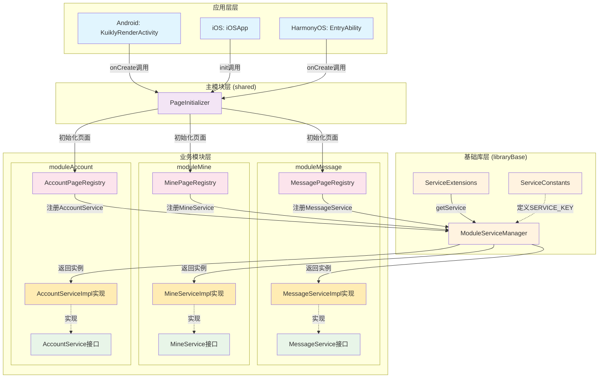

# kuiklyMultiModuleDemo

## 项目概述

kuiklyMultiModuleDemo 是一个基于 Kuikly 框架的跨平台多模块架构演示项目，支持 Android、iOS 和 HarmonyOS 三大平台。项目采用 Kotlin Multiplatform 技术栈，实现了代码共享和平台特定的优化。

## 架构设计

### 1. 整体架构

#### 1.1 架构层次图



#### 1.2 模块交互图




### 2. 模块依赖关系

```
Platform Apps (androidApp, iosApp, ohosApp)
    ↓
Shared Module (shared)
    ↓
Business Modules (moduleAccount, moduleMessage, moduleMine)
    ↓
Foundation Module (libraryBase)
    ↓
Kuikly Framework
```

### 3. 技术栈

#### 核心技术
- **Kotlin Multiplatform**: 跨平台代码共享
- **Kuikly Framework**: 腾讯开源的跨平台 UI 框架
- **Gradle**: 构建系统
- **KSP (Kotlin Symbol Processing)**: 代码生成

#### 平台特定技术
- **Android**: Kotlin + Android SDK
- **iOS**: Swift + CocoaPods + Objective-C 桥接
- **HarmonyOS**: ArkTS + Native 开发

### 4. 模块详细说明

#### 4.1 Shared Module (主模块)
- **职责**: 作为主模块，负责整合所有业务模块
- **配置**: `isMainModule = true`
- **子模块**: `moduleMine&moduleMessage&moduleAccount`
- **平台支持**: Android, iOS, HarmonyOS

#### 4.2 Business Modules (业务模块)

##### moduleAccount (账户模块)
- **命名空间**: `com.susir.account.moduleAccount`
- **职责**: 用户账户管理、登录注册等功能
- **依赖**: libraryBase

##### moduleMessage (消息模块)
- **命名空间**: `com.susir.message.moduleMessage`
- **职责**: 消息处理、通知管理等功能
- **依赖**: libraryBase

##### moduleMine (个人中心模块)
- **命名空间**: `com.susir.mine.moduleMine`
- **职责**: 个人信息、设置等功能
- **依赖**: libraryBase

#### 4.3 libraryBase (基础模块)
- **命名空间**: `com.susir.librarybase.libraryBase`
- **职责**: 
  - 提供基础组件和工具类
  - 封装通用业务逻辑
  - 定义平台抽象接口
- **配置**: `isMainModule = false`

### 5. 跨平台配置

#### 5.1 版本管理
```kotlin
// Kuikly 版本配置
KUIKLY_VERSION = "2.1.1"
KOTLIN_VERSION = "1.9.22"
KOTLIN_OHOS_VERSION = "2.0.21-ohos"

// 版本号规则
Android/iOS: ${KUIKLY_VERSION}-${KOTLIN_VERSION}
HarmonyOS: ${KUIKLY_VERSION}-${KOTLIN_OHOS_VERSION}
```

#### 5.2 平台特定配置

##### Android 配置
- **编译 SDK**: 34
- **最小 SDK**: 21
- **目标 SDK**: 30
- **JVM 目标**: 1.8

##### iOS 配置
- **部署目标**: iOS 14.1+
- **架构支持**: x64, arm64, simulatorArm64
- **CocoaPods**: 依赖管理
- **框架**: OpenKuiklyIOSRender 2.1.1

##### HarmonyOS 配置
- **目标架构**: ohosArm64
- **构建文件**: build.ohos.gradle.kts
- **包管理**: oh-package.json5

### 6. 构建系统

#### 6.1 多平台构建配置
```kotlin
// settings.gradle.kts - 标准构建
include(":androidApp", ":shared", ":libraryBase", 
        ":moduleMine", ":moduleMessage", ":moduleAccount")

// settings.ohos.gradle.kts - HarmonyOS 构建
// 使用 build.ohos.gradle.kts 作为构建文件
```

#### 6.2 KSP 代码生成配置
每个模块都配置了 KSP 参数：
- `moduleId`: 模块标识符
- `isMainModule`: 是否为主模块
- `subModules`: 子模块列表（用&分隔）
- `enableMultiModule`: 启用多模块支持

### 7. 跨模块接口调用

#### 7.1 服务接口定义
项目通过服务接口实现跨模块通信，每个业务模块都定义了对应的服务接口：

```kotlin
// MessageService.kt - 消息模块服务接口
interface MessageService {
    fun getModuleName(): String
}

// MineService.kt - 个人中心模块服务接口  
interface MineService {
    fun getModuleName(): String
}

// AccountService.kt - 账户模块服务接口
interface AccountService {
    fun getModuleName(): String
}
```

#### 7.2 服务实现与注册
各模块通过 `ModuleServiceManager` 注册服务实现：

```kotlin
// MessagePageRegistry.kt - 消息模块注册
ModuleServiceManager.registerService(
    ServiceConstants.MESSAGE_SERVICE, 
    MessageServiceImpl.INSTANCE
)

// MinePageRegistry.kt - 个人中心模块注册
ModuleServiceManager.registerService(
    ServiceConstants.MINE_SERVICE, 
    MineServiceImpl.INSTANCE
)

// AccountPageRegistry.kt - 账户模块注册
ModuleServiceManager.registerService(
    ServiceConstants.ACCOUNT_SERVICE, 
    AccountServiceImpl.INSTANCE
)
```

#### 7.3 跨模块调用机制
通过扩展函数实现便捷的跨模块服务调用：

```kotlin
// ServiceExtensions.kt - 扩展函数定义
fun getMessageService(): MessageService? = 
    ModuleServiceManager.getService(ServiceConstants.MESSAGE_SERVICE)

fun getMineService(): MineService? = 
    ModuleServiceManager.getService(ServiceConstants.MINE_SERVICE)

fun getAccountService(): AccountService? = 
    ModuleServiceManager.getService(ServiceConstants.ACCOUNT_SERVICE)
```

#### 7.4 实际调用示例
在业务代码中的跨模块调用：

```kotlin
// MineDemoPage.kt - 在个人中心模块调用消息模块服务
class MineDemoPage : KRPage() {
    override fun render(): KRNode {
        // 跨模块调用获取消息模块名称
        val messageName = getMessageService()?.getModuleName() ?: "Unknown"
        val mineName = getMineService()?.getModuleName() ?: "Unknown"
        
        return KRColumn {
            // 使用获取到的模块信息
        }
    }
}
```

#### 7.5 服务管理器实现
`ModuleServiceManager` 提供统一的服务注册和获取机制：

```kotlin
object ModuleServiceManager {
    private val serviceCache = mutableMapOf<String, Any>()
    private val serviceProviders = mutableMapOf<String, () -> Any>()
    
    fun <T> registerService(serviceKey: String, serviceInstance: T) {
        serviceCache[serviceKey] = serviceInstance as Any
    }
    
    fun <T> getService(serviceKey: String): T? {
        return serviceCache[serviceKey] as? T
    }
}
```

### 8. 平台初始化逻辑

#### 8.1 Android 平台初始化
在 Android 应用中，页面初始化在 `KuiklyRenderActivity` 的 `onCreate` 方法中执行：

```kotlin
// KuiklyRenderActivity.kt
class KuiklyRenderActivity : ComponentActivity() {
    override fun onCreate(savedInstanceState: Bundle?) {
        super.onCreate(savedInstanceState)
        
        // 初始化多模块页面服务
        PageInitializer.initializePages()
        
        // 其他初始化逻辑...
    }
}
```

#### 8.2 iOS 平台初始化
在 iOS 应用中，页面初始化在 `iOSApp` 的 `init` 方法中执行：

```swift
// iOSApp.swift
@main
struct iOSApp: App {
    init() {
        // 初始化多模块页面服务
        PageInitializer.shared.initializePages()
    }
    
    var body: some Scene {
        WindowGroup {
            ContentView()
        }
    }
}
```

#### 8.3 HarmonyOS 平台初始化
在 HarmonyOS 应用中，页面初始化在 `EntryAbility` 的 `onCreate` 方法中执行：

```typescript
// EntryAbility.ets
export default class EntryAbility extends UIAbility {
  onCreate(want: Want, launchParam: AbilityConstant.LaunchParam): void {
    hilog.info(0x0000, 'testTag', '%{public}s', 'Ability onCreate');
    
    try {
      // 初始化多模块页面服务
      hilog.info(0x0000, 'testTag', '%{public}s', 'Starting PageInitializer.initializePages()');
      const result = initializePages();
      if (result === 0) {
        hilog.info(0x0000, 'testTag', '%{public}s', 'PageInitializer.initializePages() completed successfully');
      } else {
        hilog.error(0x0000, 'testTag', 'PageInitializer.initializePages() failed with code: %{public}d', result);
      }
    } catch (error) {
      hilog.error(0x0000, 'testTag', 'Failed to initialize pages: %{public}s', JSON.stringify(error) ?? '');
    }
  }
}
```

#### 8.4 页面初始化器实现
`PageInitializer` 负责统一注册所有模块的页面和服务：

```kotlin
// PageInitializer.kt
object PageInitializer {
    fun initializePages() {
        // 注册各模块页面
        MinePageRegistry.registerPages()
        MessagePageRegistry.registerPages()  
        AccountPageRegistry.registerPages()
    }
}
```

### 9. 图片资源管理

#### 9.1 资源目录结构

项目采用模块化的图片资源管理方式，每个模块都有独立的 assets 目录：
PS：Android天然支持不同模块的assets目录，每个模块的assets目录下可以有自己的图片资源。可以正常展示
    iOS和ohos需要生成产物加入到原生项目工程中，才可以使用。即需要将不同模块素材合并到主模块（这里对应的shared模块）commonMain/assets目录下才会生效。
    这里在业务模块的assets下多添加一个模块名的文件夹，来降低文件夹数量

```
模块名/src/commonMain/assets/
└── 模块名/
    ├── common/           # 模块通用图片资源
    │   └── *.png
    └── 页面名/           # 页面特定图片资源
        └── *.png
```

**实际目录示例：**
```
libraryBase/src/commonMain/assets/
└── libraryBase/
    ├── common/
    │   └── common_base_btn_back_ic.png
    └── BaseDemoPage/
        └── base_btn_back_ic.png

moduleMine/src/commonMain/assets/
└── moduleMine/
    ├── common/
    │   └── common_mine_btn_back_ic.png
    └── MineDemoPage/
        └── mine_btn_back_ic.png
```

#### 9.2 图片加载扩展方法

项目在 `libraryBase` 模块中提供了便捷的图片加载扩展方法：

**模块通用资源加载：**
```kotlin
// 自动识别当前模块
ImageAttr.srcCommon("icon_name.png")

// 指定模块名称
ImageAttr.srcCommon("icon_name.png", "moduleMine")
```

**页面特定资源加载：**
```kotlin
// 自动识别当前模块和页面
ImageAttr.srcPage("page_icon.png")

// 指定模块和页面
ImageAttr.srcPage("page_icon.png", "moduleMine", "MineDemoPage")
```

**背景图片设置：**
```kotlin
// 页面特定背景
GroupAttr.backgroundPageImage("bg_image.png")

// 模块通用背景
GroupAttr.backgroundCommonImage("common_bg.png")
```

**头像加载（带默认图）：**
```kotlin
ImageAttr.srcAvatar("https://example.com/avatar.jpg")
// 自动设置默认头像：assets://libraryBase/common/base_default_user_avatar.png
```

### 10. 开发规范

#### 10.1 模块开发原则
1. **单一职责**: 每个模块专注于特定的业务领域
2. **依赖倒置**: 业务模块依赖基础模块，不直接依赖其他业务模块
3. **接口隔离**: 通过接口定义模块间的通信协议
4. **开闭原则**: 模块对扩展开放，对修改封闭

#### 10.2 跨平台开发注意事项
1. **避免平台特定代码**: 在 commonMain 中不使用平台特定的 API
3. **资源管理**: 将共享资源放在 commonMain/assets 目录
4. **测试策略**: 为每个平台编写对应的测试用例

### 11. 项目结构

```
kuiklyMultiModuleDemo/
├── androidApp/                 # Android 应用
├── iosApp/                     # iOS 应用
├── ohosApp/                    # HarmonyOS 应用
├── shared/                     # 主共享模块
├── libraryBase/                # 基础库模块
├── moduleAccount/              # 账户业务模块
├── moduleMessage/              # 消息业务模块
├── moduleMine/                 # 个人中心业务模块
├── buildSrc/                   # 构建脚本
├── gradle/                     # Gradle 配置
├── build.gradle.kts            # 根构建文件
├── build.ohos.gradle.kts       # HarmonyOS 构建文件
├── settings.gradle.kts         # 项目设置
└── settings.ohos.gradle.kts    # HarmonyOS 项目设置
```

### 12. 快速开始

#### 12.1 环境要求
- JDK 8+
- Android Studio Arctic Fox+
- Xcode 13+ (iOS 开发)
- DevEco Studio (HarmonyOS 开发)

#### 12.2 构建命令
```bash
# Android 构建
./gradlew :androidApp:assembleDebug

# iOS 构建
cd iosApp && xcodebuild

# HarmonyOS 构建
./gradlew -c settings.ohos.gradle.kts build
```

### 13. 扩展指南

#### 13.1 添加新业务模块
1. 创建新模块目录
2. 配置 build.gradle.kts 和 build.ohos.gradle.kts
3. 在 settings 文件中注册模块
4. 在 shared 模块中添加依赖
5. 配置 KSP 参数